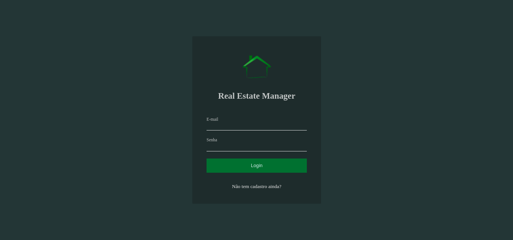
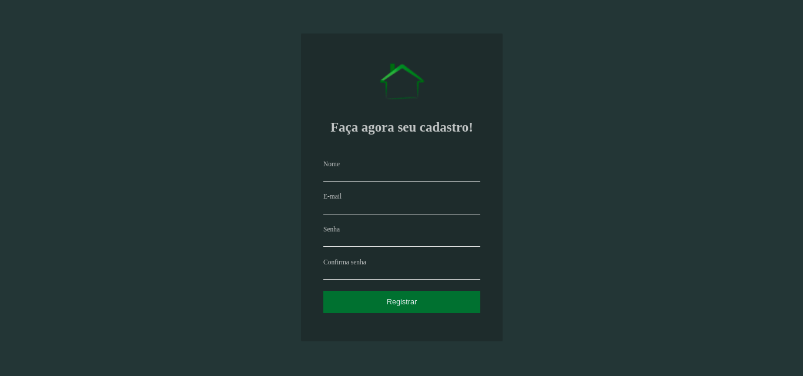
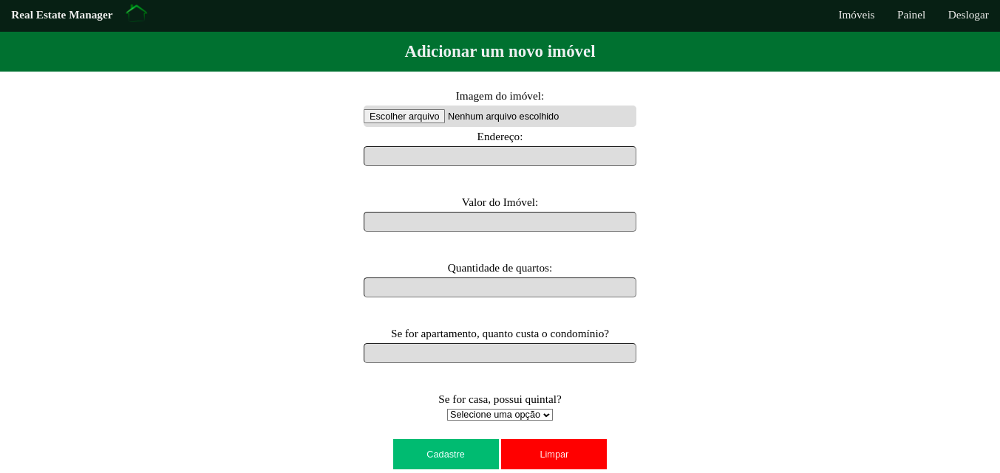

# Real Estate Manager

## Introdução
Um sistema de gerenciamento de imóveis, feito com PHP, onde permite aos usuários adicionar imóveis com os seguintes dados:

- Endereço do imóvel
- Valor requisitado
- Quantidade de quartos
- Tem condomínio?
- Possui quintal?
- Imagem do imóvel

## Requisitos mínimos
- PHP >= 7.4
- Composer >= 2.3
- DB relacional
- WSL2 (p/ Windows)

## Configurações
Para funcionar, tu deve fazer uma configuração simples. Crie um arquivo database.php na pasta `src/shared/config` e insira suas credenciais do SGBD:

```
  define("DRIVER", <seu_driver_do banco>);
  define("DBHOST", <hospedagem>);
  define("DBUSER", <nome_de_usuario>);
  define("PASS", <senha_do_banco>);
  define("DBNAME", <nome_do_banco_de_dados>);
```

## Criação das tabelas para um banco relacional
Após isso, precisará criar as tabelas do banco de dados, sendo assim, rode sequencialmente no terminal:

Se caso for usar o MySQL, poderá acessar usando o script!
```
  bash scripts/mysql.sh
```

```
  source sql/user.sql
  source sql/apartament.sql
  source sql/house.sql
  source sql/immobile.sql
```

## Rode a aplicação via Bash Script
Agora que o banco de dados está configurado, o próximo passo é testar o sistema:

```
  bash scripts/run.sh
```

Quando executar a aplicação, vai no browser de sua preferência (indico o [Brave Web Browser](https://brave.com/pt/)), e acesse: [127.0.0.1:8080](http://127.0.0.1:8080) na sua máquina.

## Login do usuário


No caso, por ser um novo usuário, precisará fazer um cadastro para ter acesso total ao sistema.

## Cadastro do usuário


Realizado o cadastro, poderá navegar e adicionar novos imóvel ao sistema.

## Adicione novos imóveis
